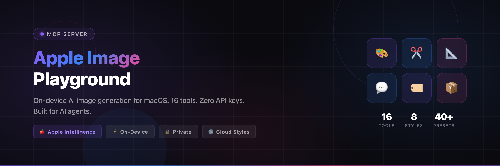

<p align="center">
  
</p>

<p align="center">
  <strong>AI image generation for macOS via Image Playground. 17 tools. Zero API keys.</strong><br>
  On-device styles (animation, illustration, sketch) + ChatGPT external styles (oil painting, watercolor, vector, anime, print).<br>
  Auto-crops for 40+ social media platforms. Built for AI agents.
</p>

<p align="center">
  <a href="https://modelcontextprotocol.io"></a>
  <a href="https://www.apple.com/macos/"></a>
  <a href="https://python.org"></a>
  <a href="LICENSE"></a>
  <a href="https://github.com/vakandi/apple-image-mcp/releases"></a>
</p>

---

## Why this exists

Other Apple Intelligence MCP servers expose one tool: `generate_image`. That's it.

**apple-image-mcp** gives your AI agent a full image pipeline:

- **8 styles** — on-device (animation, illustration, sketch, emoji) + ChatGPT external (oil painting, watercolor, vector, anime, print) via Shortcuts.app
- **17 tools** — generate, crop, batch, watermark, text overlay, filters, social packs
- **40+ platform presets** — Instagram, TikTok, LinkedIn, YouTube, Pinterest, blog headers — all one prompt away
- **Zero config** — runs locally on any Apple Silicon Mac with Apple Intelligence enabled

---

## Quick Start

### Option A — npx (recommended, zero setup)

```bash
npx mcp-apple-image-playground
```

That's it. Python deps install automatically on first run.

### Option B — npm install

```bash
npm install -g mcp-apple-image-playground
mcp-apple-image-playground
```

### Option C — From source

```bash
pip install "mcp[cli]" pillow
python3 apple_intelligence_community_manager.py
```

---

## IDE Integration

### Cursor / Windsurf / VS Code

Add to your MCP config (`.cursor/mcp.json` or Settings → MCP):

```json
{
  "mcpServers": {
    "apple_image": {
      "command": "npx",
      "args": ["mcp-apple-image-playground"]
    }
  }
}
```

> **Note:** If Cursor can't find npx, use the full path:
> `"command": "/Users/YOU/.nvm/versions/node/v20.x.x/bin/npx"`

### Claude Desktop

Add to `~/Library/Application Support/Claude/claude_desktop_config.json`:

```json
{
  "mcpServers": {
    "apple_image": {
      "command": "npx",
      "args": ["mcp-apple-image-playground"]
    }
  }
}
```

### OpenCode

Add to `~/.config/opencode/opencode.json` under `"mcp"`:

```json
{
  "mcp": {
    "apple-image": {
      "type": "local",
      "command": ["npx", "mcp-apple-image-playground"],
      "enabled": true
    }
  }
}
```

### Claude Code / opencode CLI

```bash
claude mcp add apple_image \
  --scope user \
  -- npx mcp-apple-image-playground
```

---

## Available Tools

### Image Generation

| Tool | Description |
|------|-------------|
| `generate_image` | Generate from text prompt via Shortcuts.app |
| `generate_social_pack` | One prompt → multiple platform-sized crops (Instagram, Twitter, LinkedIn…) |
| `generate_bundle` | Generate for a predefined bundle (e.g. `full_social`, `blog_set`) |
| `generate_batch` | Generate multiple images from a list of prompts |

### Image Processing

| Tool | Description |
|------|-------------|
| `add_text_overlay` | Add text with custom font, position, color, shadow |
| `add_watermark` | Brand watermark with opacity control |
| `create_gradient` | Generate gradient backgrounds (vertical, horizontal, diagonal) |
| `create_text_post` | Ready-to-post text image (quote, announcement, tip) |
| `apply_filter` | Blur, sharpen, brightness, contrast, sepia, noir |
| `smart_crop` | Face-aware crop using Apple's Vision framework |
| `crop_image` | Crop existing image to multiple platform sizes |
| `resize_image` | Resize to exact dimensions or scale factor |

### Discovery

| Tool | Description |
|------|-------------|
| `list_engines` | Check which engines are available |
| `list_styles` | Show all available styles (on-device + ChatGPT external) |
| `list_presets` | All 40+ platform presets with exact dimensions |
| `list_bundles` | Predefined bundles (full_social, instagram_set, blog_set…) |

---

## Engine Details

### On-Device (Apple Intelligence)

- **Styles**: `animation`, `illustration`, `sketch`, `emoji`
- **Requires**: macOS 15.4+ with Apple Intelligence enabled, Apple Silicon Mac
- **Privacy**: Runs entirely on your machine. No images leave your device.
- **Speed**: ~5-10 seconds per image

### ChatGPT External Styles

- **Styles**: `oil_painting`, `watercolor`, `vector`, `anime`, `print`
- **Requires**: Internet connection, ChatGPT integrated into Siri
- **How it works**: Routes through Siri's ChatGPT integration via Shortcuts.app
- **Speed**: ~10-30 seconds per image (network dependent)

---

## Platform Presets

One prompt → perfectly sized for every platform:

```
Instagram:   post (1080×1080) · portrait (1080×1350) · story (1080×1920) · reel cover
Twitter/X:   post (1200×675)  · header (1500×500)  · card (1200×628)
LinkedIn:     post (1200×628)  · article (744×400)  · banner (1584×396)
YouTube:      thumbnail (1280×720) · channel art (2560×1440) · short (1080×1920)
Pinterest:    pin (1000×1500)  · story (1080×1920)
Blog:         header (1200×630) · hero (1920×1080) · thumbnail (400×300)
Facebook:     post (1200×630)  · cover (820×312)   · story (1080×1920)
TikTok:       video cover (1080×1920)
```

Full list: call `list_platform_presets` on the running server.

---

## Example Agent Calls

### Generate a social media pack

```python
generate_social_pack(
    prompt="a cozy coffee shop in autumn, warm colors",
    platforms=["instagram_post", "twitter_post", "linkedin_post"],
    style="illustration"
)
# → 3 images, each cropped to the perfect platform size
```

### Generate an oil painting

```python
generate_image(
    prompt="a serene mountain landscape at golden hour",
    style="oil_painting"
)
# → 1536×1536 oil painting via ChatGPT external style
```

### Generate a bundle for your blog

```python
generate_bundle(
    prompt="a rocket launching into a starry sky",
    bundle="blog_set",
    style="illustration"
)
# → multiple images: blog_header, blog_inline, blog_thumbnail, og_image, square_thumbnail
```

### Create a text post for social

```python
create_text_post(
    text="50% OFF everything this weekend",
    width=1080,
    height=1080,
    bg_color="#1a1a2e",
    font_color="#FFFFFF",
    gradient=True
)
# → ready-to-post text image with gradient background
```

### Add text overlay to an image

```python
add_text_overlay(
    image_path="/path/to/image.png",
    text="50% OFF",
    position="center",
    font_size=72,
    font_color="#FF0000",
    bg_color="#000000"
)
```

---

## Requirements

| Requirement | Details |
|-------------|---------|
| **macOS** | 15.4+ (Sequoia) or 26+ (Tahoe) |
| **Hardware** | Apple Silicon Mac (M1, M2, M3, M4, M5) |
| **Apple Intelligence** | Enabled in System Settings → Apple Intelligence & Siri |
| **Image Playground** | Open once to download models (one-time, ~2GB) |
| **Node.js** | 18+ (for npx) |
| **Python** | 3.10+ (auto-installed with deps if missing) |

---

## Configuration

### Environment Variables

| Variable | Default | Description |
|----------|---------|-------------|
| `APPLE_IMAGE_OUTPUT_DIR` | `~/Pictures/AI-Generated` | Where generated images are saved |
| `APPLE_IMAGE_DEFAULT_STYLE` | `illustration` | Default style |

---

## Troubleshooting

### `ImagePlayground.ImageCreator.Error.creationFailed`

This is a known macOS issue, especially on beta builds. Fixes:

1. Open **Image Playground.app** and generate one image manually
2. Confirm Apple Intelligence is enabled in System Settings
3. Ensure Image Playground models are fully downloaded

### Dock icon flashes during generation

Expected behavior. Apple's `ImageCreator` requires the app to run in the foreground. The helper temporarily sets a Dock icon, generates, then exits. The icon disappears automatically.

### ChatGPT external styles timeout

ChatGPT external styles (oil_painting, watercolor, vector, anime, print) require an active internet connection and ChatGPT integration. If they timeout, check your network and ensure Siri/ChatGPT is configured in System Settings.

---

## Architecture

```
┌──────────────────┐     ┌──────────────────────────┐     ┌─────────────────┐
│  MCP Client      │────▶│  npx launcher            │────▶│  Python MCP     │
│  (Claude, Cursor │◀────│  (Node.js, auto-deps)    │◀────│  (FastMCP)      │
│   OpenCode, etc.)│     │                          │     │                 │
└──────────────────┘     └──────────────────────────┘     ├─ Shortcuts.app │
                                                          │  (on-device)   │
                                                          │  styles:       │
                                                          │  animation,    │
                                                          │  illustration, │
                                                          │  sketch, emoji │
                                                          │                │
                                                          ├─ ChatGPT       │
                                                          │  (external)    │
                                                          │  via Siri      │
                                                          └─────────────────┘
```

The Node.js launcher handles Python dependency management and Swift compilation automatically. The Python server exposes 17 MCP tools via stdio transport. All image generation goes through Shortcuts.app's GenerateImageIntent — on-device styles use Apple's Image Playground directly, external styles route through Siri's ChatGPT integration.

---

## Project Structure

```
apple-image-mcp/
├── bin/
│   └── mcp-apple-image-playground   # Node.js launcher (npx entry point)
├── apple_intelligence/              # Python package
│   ├── __init__.py
│   ├── server.py                    # 16 MCP tool definitions
│   ├── engines.py                   # Shortcuts.app engine
│   ├── processing.py                # PIL crop, resize, font utilities
│   ├── platforms.py                 # 40+ platform presets & bundles
│   └── response.py                  # Structured response helpers
├── apple_intelligence_community_manager.py  # Python MCP server entry point
├── imagegen_helper.swift            # Swift binary source
├── postinstall.js                   # Auto-setup on npm install
├── package.json
├── README.md
└── LICENSE
```

---

## Contributing

Contributions welcome. Please open an issue first to discuss what you'd like to change.

---

## License

MIT License. See [LICENSE](LICENSE) for details.

---

## Acknowledgments

- [Apple ImagePlayground API](https://developer.apple.com/documentation/imageplayground) — the on-device image generation framework
- [FastMCP](https://github.com/jlowin/fastmcp) — the MCP server framework
- [Pillow](https://python-pillow.org) — image processing
